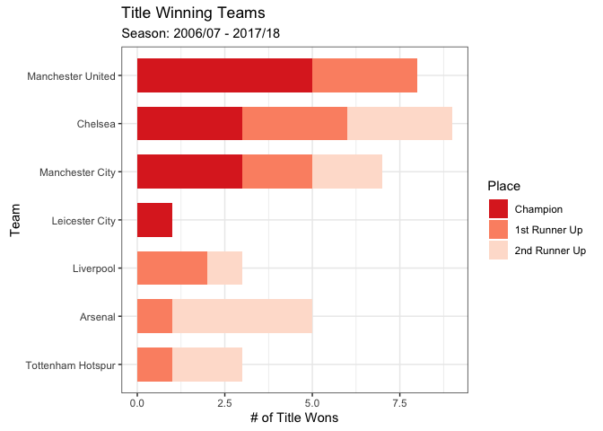
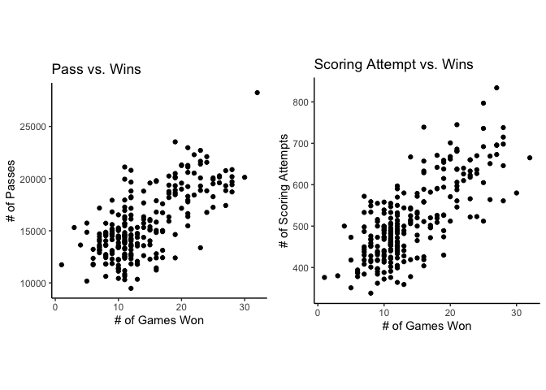
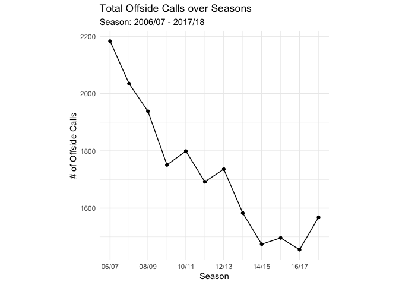
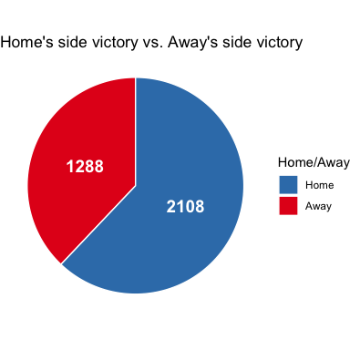

Premier League Data Analysis
================
Teik Keat Tee
2023-12-12

### 1. Introduction

The data of interest selected for this assignment was the Premier League
data by Zaeem Nalla from Kaggle.

Premier League (also known as ‘Barclays Premier League’ or ‘English
Premier League (EPL)’) is the most pronounced and the highest level
division of the English football league system. It was formed in
February 20, 1992, and contested by 20 English clubs each season,
following the English Football League’s promotion and relegation system.
Under this operation, we would observed changes of clubs for each
season.

#### 1.1 Problem Statement

The Official Premier League data was mainly collected and processed by
its exclusive statistics partner - ‘Stats Perform’. According to the
author of the Kaggle dataset, stats providers don’t usually tend to
release their data or analysed results for public access. This was true
given that parties such as sports betting entities would be free from
any form of cost constraints if it was the case. However, normal
individuals like us might suffer from these constraints, when we only
wish to improve our understanding about EPL teams and matches for
personal interests. Furthermore, it would also be difficult for
smaller-sized football club to form analysis about EPL matches and make
better informed decisions towards improving their teams’ performances in
league matches.

#### 1.2 Objective

Given above problem statement, I am motivated to utilise the dataset
extracted from Kaggle and perform some analysis on top of it.

The general purpose of this assignment is to provide some insights about
club performances within the season of 2006/07 to 2017/18. These
insights can either be employed as a reference for future match outcome
prediction, or as a top-level understanding for someone who’s newly
interested in EPL. The analysis covers a demonstration of top performing
teams, key factors that affects the match outcomes, and interesting
facts such as ‘Offside Violation’.

#### 1.3 Data description

The raw dataset contains information of match results and team
statistics for each season across 12 seasons, from season 2006/07 to
season 2017/18. This dataset was originated from the Official Premier
League website and scrapped, organised, and formatted by the author.
This dataset comprises two tabular data formatted in csv files, namely
results.csv and stats.csv. I aim to explore both data in a
contemporaneous manner for the following analyses.

------------------------------------------------------------------------

### 2. Data Preparation

Prior to the analyses, some steps should be taken care of. These include
data extraction, data inspection, data preprocessing and importing
dependencies.

#### 2.1 Import Dependencies

``` r
library(tidyverse) # [v2.0.0] For data wrangling
library(ggplot2) # [v3.4.4] For plotting
library(gridExtra) # [v2.3] For arranging plots
```

#### 2.2 Data Extraction

``` r
# Extracting the raw data from results.csv and stats.csv to a data frame
# Note that both csv files were stored in my github
results_df <- data.frame(read_csv("https://raw.githubusercontent.com/teikkeat80/Premier_League_Data_Analysis/main/premier_league_data/results.csv"))

stats_df <- data.frame(read_csv("https://raw.githubusercontent.com/teikkeat80/Premier_League_Data_Analysis/main/premier_league_data/stats.csv"))
```

#### 2.3 Data Inspection

Data inspection was always the first and foremost step to be conducted
prior to performing analytical work. Through looking at the initial
rows, structure and dimension of the data object, I am able to
understand how the extracted data looks like from a top-level.

``` r
# Inspect initial rows of results.csv and stats.csv
head(results_df)
```

    ##          home_team        away_team home_goals away_goals result    season
    ## 1 Sheffield United        Liverpool          1          1      D 2006-2007
    ## 2          Arsenal      Aston Villa          1          1      D 2006-2007
    ## 3          Everton          Watford          2          1      H 2006-2007
    ## 4 Newcastle United   Wigan Athletic          2          1      H 2006-2007
    ## 5       Portsmouth Blackburn Rovers          3          0      H 2006-2007
    ## 6          Reading    Middlesbrough          3          2      H 2006-2007

``` r
head(stats_df)
```

    ##                team wins losses goals total_yel_card total_red_card
    ## 1 Manchester United   28      5    83             60              1
    ## 2           Chelsea   24      3    64             62              4
    ## 3         Liverpool   20     10    57             44              0
    ## 4           Arsenal   19      8    63             59              3
    ## 5 Tottenham Hotspur   17     12    57             48              3
    ## 6  Bolton Wanderers   16     14    47             84              4
    ##   total_scoring_att ontarget_scoring_att hit_woodwork att_hd_goal att_pen_goal
    ## 1               698                  256           21          12            5
    ## 2               636                  216           14          16            3
    ## 3               668                  214           15           8            6
    ## 4               638                  226           19          10           10
    ## 5               520                  184            6           5            6
    ## 6               404                  120            7          10            6
    ##   att_freekick_goal att_ibox_goal att_obox_goal goal_fastbreak total_offside
    ## 1                 1            72            11              9            80
    ## 2                 6            41            23              6           127
    ## 3                 1            46            11              3           120
    ## 4                 3            53            10              7           111
    ## 5                 2            44            13              9           149
    ## 6                 0            38             9              3            95
    ##   clean_sheet goals_conceded saves outfielder_block interception total_tackle
    ## 1          16             27     2               81          254          890
    ## 2          22             24     4               74          292          982
    ## 3          20             27     1               65          246          969
    ## 4          12             35     6               73          214          998
    ## 5           6             54    11              128          276          995
    ## 6          12             52    13              101          235          811
    ##   last_man_tackle total_clearance head_clearance own_goals penalty_conceded
    ## 1               1            1222             NA         1                5
    ## 2               0            1206             NA         1                3
    ## 3               2            1115             NA         0                1
    ## 4               1            1202             NA         1                3
    ## 5               2            1412             NA         2                7
    ## 6               0            1037             NA         3                8
    ##   pen_goals_conceded total_pass total_through_ball total_long_balls
    ## 1                  3      18723                 NA             2397
    ## 2                  2      16759                 NA             2270
    ## 3                  1      17154                 NA             2800
    ## 4                  3      18458                 NA             2045
    ## 5                  6      14914                 NA             2408
    ## 6                  6      12400                 NA             2403
    ##   backward_pass total_cross corner_taken touches big_chance_missed
    ## 1            NA         918          258   25686                NA
    ## 2            NA         897          231   24010                NA
    ## 3            NA        1107          282   24150                NA
    ## 4            NA         873          278   25592                NA
    ## 5            NA         796          181   22200                NA
    ## 6            NA         942          217   18932                NA
    ##   clearance_off_line dispossessed penalty_save total_high_claim punches
    ## 1                  1           NA            2               37      25
    ## 2                  2           NA            1               74      22
    ## 3                  1           NA            0               51      27
    ## 4                  1           NA            0               88      27
    ## 5                  2           NA            0               51      24
    ## 6                  6           NA            2               44      21
    ##      season
    ## 1 2006-2007
    ## 2 2006-2007
    ## 3 2006-2007
    ## 4 2006-2007
    ## 5 2006-2007
    ## 6 2006-2007

``` r
# Inspect the dimensions of results.csv
print(paste0("[results table] rows: ", 
             dim(results_df)[1], 
             " columns: ",
             dim(results_df)[2]))
```

    ## [1] "[results table] rows: 4560 columns: 6"

``` r
# Inspect the dimensions of stats.csv
print(paste0("[stats table] rows: ", 
             dim(stats_df)[1], 
             " columns: ",
             dim(stats_df)[2]))
```

    ## [1] "[stats table] rows: 240 columns: 42"

During the data extraction phase, as a result of dplyr’s package -
read_csv(), the column values were converted to appropriate data types.
The dimensional inspection shows that results table consists of 4560
rows and 6 columns, while the stats table consists of 240 rows and 42
columns. Lastly, the initial rows of both tables also shows good
condition of data, apart from some missing values identified in the
stats table.

The results table shows no missing values for both categorical and
numerical columns. No anomalies were detected for the categorical
columns, as I may observed from the unique values and whitespace. For
the numerical values, we can observe the maximum goals per match is 9
goals for home goals and 7 goals for away goals. Although these values
were treated as outliers based on Interquartile Range, however it they
were sensible values for our situation.

The stats table also shows no missing values for the categorical
columns, however there were NAs appearing in some of the numerical
columns, these include: “saves”, “head_clearance”, “total_through_ball”,
and “dispossessed” (20 NA values), and “backward_pass”,
“big_chance_missed” (80 NA values). These NA values were missing from
the Premier League’s website. However, these does not contains the
columns being used in this analysis, where they would be removed in
section 2.4. In terms of the anomaly values, no anomalies were detected
in both categorical and numerical columns. Although there were some
outliers, they were all sensible values.

Overall, the raw data were mostly cleaned up and presented in a good
state. This is reasonable as it was obtained from Kaggle.

#### 2.4 Data Preprocessing

Despite the raw data is in a good quality, I aim to do some high-level
pre-processing steps to make the flow of the analysis better. In
particular, removing the irrelevant columns in stats_df (as all columns
in results_df is relevant).

``` r
# Select only relevant columns from stats_df
# This is also a better practice to optimise code performance
stats_df <- stats_df %>% 
  select(team, season, goals, goals_conceded, wins, total_pass, total_scoring_att, total_offside)
```

Now the data is ready for the analysis!

**Note: Any further particular data transformation process will be
considered during the analysis, if required.**

------------------------------------------------------------------------

### 3. EPL Analysis

In this section I present the analysis for the performances and key
statistics of all EPL football clubs which participated in seasons from
2006/07 to 2017/18.

#### 3.1 Top Performing Teams - *Analysis 1*

Firstly, it would be interesting to identify which clubs has won the
most titles within these 12 seasons. Through observing the EPL title
earners and top finishers, I could potentially find out the outstanding
clubs of EPL.

EPL rank teams based on points and several tie-breaker rules, presented
as follows in an orderly manner. For simplicity, I have only considered
3 of them, while it was usually rare to go any further.

1.  Points
2.  Goal Difference
3.  Total Goals Scored

The points attributing system for each match is as follows:

1.  Winning team gets 3 points
2.  Losing team gets 0 points
3.  Both teams gets 1 points in the occasion of a tie.

``` r
# Extract relevant columns from stats table
a1_goals <- stats_df %>% 
  select(team, season, goals, goals_conceded) %>% 
  # Calculate goal differences
  mutate(goal_diff = goals - goals_conceded)

# Calculate points obtained for each match from results table
# Alternatively, we can use the wins and losses from the stats table, but what if we only have the results table?
a1_pt <- results_df %>% 
  mutate(home_pt = if_else(result == "H", 3, if_else(result == "A", 0, 1)), 
         away_pt = if_else(result == "H", 0, if_else(result == "A", 3, 1)))

# Create a summarised data frame that calculate total points earned for each team in each season
a1_pt_sum <- a1_pt %>% 
  select(home_team, away_team, home_pt, away_pt, season) %>% 
  pivot_longer(cols = ends_with("pt"), names_to = "hoa", values_to = "pt") %>% 
  mutate(team = if_else(hoa == "home_pt", home_team, away_team)) %>% 
  select(-ends_with("_team"), -hoa) %>% 
  group_by(season, team) %>% 
  summarise(total_pt = sum(pt), .groups = 'drop') %>% 
  as.data.frame()

# Now that both tables has the same number of rows, I can proceed with joining both tables
a1_join <- inner_join(a1_goals, a1_pt_sum, by = c("season", "team")) %>% 
  select(-goals_conceded)

# Finds out the teams' position for each season and filter only top 3 teams
a1_pos <- a1_join %>% 
  group_by(season) %>% 
  arrange(desc(total_pt), desc(goal_diff), desc(goals)) %>% 
  mutate(position = row_number()) %>% 
  filter(position <= 3) %>% 
  ungroup()

# Summarise total champions and runner ups earned for each team
# The teams were ranked based on: Most Champion, 2nd Most Champion, ..., Most 1st runner up, ...
a1_sum <- a1_pos %>% 
  select(team, position) %>% 
  mutate(position = as.character(position), value = 1) %>% 
  pivot_wider(names_from = position, values_from = value, values_fn = sum, values_fill = 0) %>% 
  rename(champion = "1", first_runner_up = "2", sec_runner_up = "3") %>% 
  arrange(desc(champion), desc(first_runner_up), desc(sec_runner_up)) %>% 
  mutate(rank = row_number())
```

``` r
# Generate a stacked bar chart
a1_sum %>% 
  # Pivot to a longer shape to generate plot
  pivot_longer(cols = c(sec_runner_up, first_runner_up, champion), 
               names_to = "place", 
               values_to = "total") %>% 
  # Amend the place column to a factor for plotting
  mutate(place = recode_factor(
    factor(place, levels = c("sec_runner_up", "first_runner_up", "champion")), 
    sec_runner_up = "2nd Runner Up", 
    first_runner_up = "1st Runner Up", 
    champion = "Champion")) %>% 
  # Start plotting
  ggplot(aes(x = reorder(team, -rank), y = total, fill = place)) + 
  geom_bar(stat = "identity", width = 0.7) + 
  theme_bw() + 
  coord_flip() + 
  guides(fill = guide_legend(reverse = TRUE)) + 
  scale_fill_brewer(palette = "Reds") + 
  labs(title = "Title Winning Teams",
  subtitle = "Season: 2006/07 - 2017/18",
  x = "Team",
  y = "# of Title Wons",
  fill = "Place") + 
  theme(aspect.ratio = 1)
```

<!-- -->

From above analysis, I have summarised 7 top performing teams in EPL
across the 12 seasons, namely Manchester United, Chelsea, Manchester
City, Leicester City, Liverpool, Arsenal, and Tottenham Hotspur.
Manchester United was the best team among all, earning a total of 5
times EPL Champion titles, followed by Chelsea and Manchester City,
earning 3 each. Nevertheless, these 3 teams came in the top 3 positions
for most seasons.

Moreover, 6 out of 7 teams here were generally perceived as the top
teams in EPL. Therefore, it would be interesting to note that Leicester
City has won a Champion title being an underdog during the 2015/16
season, where they started the season with odds of 1:5000 being the
Champion. This was one of the greatest event in the EPL’s history.

#### 3.2 Does passing or attacking leads to winning? - *Analysis 2*

A professional football team usually consists of 11 in-field players,
with positions such as striker, goalkeeper, defender, and mid-fielder.
The chemistry between all of these players is the key for the match
outcome. Generally, the number of passes would determines how well the
team cooperates in a football match.

Apart from the collaboration of a team, offensive strategies were also
important for winning a football match (as you can only win by scoring
goals!). A team with good offensive tactics tends to create many scoring
attempts in a match.

As a result, I aim to assess the relationship between passes and scoring
attempts with winnings in this section.

``` r
# Extract relevant columns from stats table
a2_df <- stats_df %>% 
  select(wins, total_pass, total_scoring_att)
```

``` r
# Generate scatter plots to observe relationship between variables
a2_scat1 <- a2_df %>% 
  ggplot(aes(x = wins, y = total_pass)) + 
  geom_point() + 
  labs(title = "Pass vs. Wins",
       y = "# of Passes",
       x = "# of Games Won") + 
  theme_classic() + 
  theme(aspect.ratio = 1)

a2_scat2 <- a2_df %>% 
  ggplot(aes(x = wins, y = total_scoring_att)) + 
  geom_point() + 
  labs(title = "Scoring Attempt vs. Wins",
       y = "# of Scoring Attempts",
       x = "# of Games Won") + 
  theme_classic() + 
  theme(aspect.ratio = 1)

# Show the plot using grid.arrange (an alternative to plot_grid)
grid.arrange(a2_scat1, a2_scat2, nrow = 1, ncol = 2)
```

<!-- -->

According the the scatter plots above, I observed a positive
relationship in both plots. This explains that both passing and
attempting to score matters! Nevertheless, it can also be explained as
having a good team chemistry leads to creating scoring attempt and
finally leads to winning a game. For brevity, I only aim to observe the
relationship between these variables (instead of technical correlation
effects). Ultimately, this analysis concludes that winning a football
match hinges on a combination of good offensive strategy and seamless
collaboration between all players.

#### 3.3 Offsides - *Analysis 3*

Offside was termed as a violation for the ball receiving player
positioning themselves in front of the ball and the second last
opponent, from the perspective of opponent’s goal line. Whenever an
offside call occurs, especially during a potential goal, it is always
frustating to the players and their supporters. As such, it would be
interesting to understand the offside dynamics thorough out the EPL’s 12
seasons.

``` r
# Extract columns of interest from stats table
a3_df <- stats_df %>% 
  select(season, total_offside)

# To observe the dynamics about how did the number of offside calls evolve until recent years, it is sensible to create a line graph.
# Therefore, I transform the data to a time series with continuous variables such as date variables.
a3_ts <- a3_df %>% 
  group_by(season) %>% 
  summarise(sum_offside = sum(total_offside)) %>% 
  # I will be using the beginning of the year of season start as the date variable
  mutate(season = as.Date(
      paste0(sub(pattern = "(\\d+)-.*", replacement = "\\1", x = season), 
             "-01-01")))
```

``` r
# Generate line plot
a3_ts %>% 
  ggplot(aes(x = season, y = sum_offside)) + 
  geom_point() + 
  geom_line() + 
  # Using the anonymous function and %m+% (from tidyverse's lubridate package) to create date labels like year/year+1 (e.g. 06/07) for display
  scale_x_date(labels = function (x) paste0(format(x, "%y"), "/", format(x %m+% years(1), "%y"))) + 
  theme_minimal() + 
  labs(title = "Total Offside Calls over Seasons",
       subtitle = "Season: 2006/07 - 2017/18",
       x = "Season",
       y = "# of Offside Calls") + 
  theme(aspect.ratio = 1)
```

<!-- -->

The line graph above shows a downward trend in offside violations
throughout the years (with the exception of it going up again in the
2017/18 season). This could be attributed to players improved in terms
of falling into offside positions from time to time. It could also be
explained as more and more players managed to get through the violation
under the eyes of referees, which could be due to a quality drop in
referees or managers’ tricks. This indicates that solely relying on
referees could be insufficient, therefore, advanced technologies such as
the VAR were developed and employed in more recent days.

#### 3.4 Home wins vs. Away wins - *Analysis 4*

Generally, home teams were perceived as the side with higher winning
odds, especially when both opposing teams were on even level. This is
due to the home side’s advantage on familiarity with the field, larger
supporting crowd, and players’ belonging feelings. In this section, I
aim to provide a comparative analysis on home and away winnings.

``` r
# Create a copy of the results table for this section
a4_df <- results_df

# Summarise home and away wins for each teams
a4_sum <- a4_df %>% 
  filter(!result == "D") %>% 
  mutate(win_team = if_else(result == "H", home_team, away_team)) %>% 
  group_by(win_team) %>% 
  summarise(
    home_wins = sum(result == "H"),
    away_wins = sum(result == "A")
  )
```

``` r
# Generate a pie chart for proportionally comparing all home and away wins throughout the years.
a4_sum %>% 
  select(home_wins, away_wins) %>% 
  pivot_longer(cols = c(away_wins, home_wins), 
               names_to = "win_type", 
               values_to = "win_total") %>% 
  group_by(win_type) %>% 
  summarise(win_total = sum(win_total)) %>% 
  mutate(win_type = str_to_title(gsub("_wins", "", win_type))) %>% 
  ggplot(aes(x = "", y = win_total, fill = win_type)) + 
  geom_bar(stat = "identity", width = 1, color = "white") + 
  # Labeling the percentages
  geom_text(aes(label = win_total, fontface = "bold"), 
            size = 5, 
            color = "white", 
            position = position_stack(vjust = 0.5)) + 
  coord_polar("y") + 
  theme_void() + 
  theme(aspect.ratio = 1) + 
  labs(
    title = "Home's side victory vs. Away's side victory",
    fill = "Home/Away"
  ) + 
  guides(fill = guide_legend(reverse = TRUE)) + 
  scale_fill_brewer(palette = "Set1")
```

<!-- -->

According to the pie chart above, I observed that generally EPL teams
tends to win the match when they are playing at their home court. Out of
all non-tying matches, home side’s victory were 63% more than away
side’s victory. This piece of information would be important for
football fans to form expectations before a match began, and for
football teams to plan a better strategy for which side their team is
playing on in future games.

#### 3.5 Is it easy to score a goal? - *Analysis 5*

Other sports enthusiasts may argue that a football match can be dull to
watch, given its long duration with relatively few exciting scoring
moments. Nevertheless, the ability to defend from conceding a goal was
also a key factor for the team to win the match. Furthermore, the goal
differences (goals scored - goals conceded) was sometimes a major tie
breaker for a team to win the championship. Therefore, let’s try to
analyse the ability of a team to defend its goal.

``` r
# Extract relevant data from the stats table
a5_df <- stats_df %>% 
  select(team, goals_conceded, season)
```

``` r
# Box plots might be a good way to showcase the goals conceded statistics
# Moreover, I will also aim to emphasise on the 'Big 4' teams in EPL, which include Manchester United, Arsenal, Chelsea, and Liverpool.
a5_df %>% 
  # Showing season label in a better presentation
  mutate(season = sub("\\d{2}(\\d{2})-\\d{2}(\\d{2})", "\\1/\\2", season)) %>% 
  ggplot(aes(x = season, y = goals_conceded, fill = season)) + 
  geom_boxplot(fill = NA, color = "grey") + 
  theme_classic() + 
  geom_text(aes(
    label = if_else(
      team %in% c("Manchester United", "Arsenal", "Chelsea", "Liverpool"), 
      substr(team, 1, 1), ""), 
    color = team, 
    fontface = "bold")) + 
  scale_color_manual(values = c("Manchester United" = "red", 
                                "Arsenal" = "black", 
                                "Chelsea" = "blue", 
                                "Liverpool" = "orange")) + 
  theme(legend.position = "None") + 
  labs(
    title = "Goals Conceded Box Plots",
    subtitle = "Season: 2006/07 - 2017/18",
    x = "Season",
    y = "# of Goals Conceded"
  )
```

<!-- -->

From above box plots, I observed that the median goals conceded
fluctuates around 40-60 goals per season. Given that a team would
usually plays 38 matches in an EPL season, we should, on average, seeing
one goal per match for each season. The 07/08 season was by far the most
interesting season that having a team losing the minimum goals and
another team losing the maximum goals, across all 12 seasons.

Apart from that, the illustration of ‘Big 4’ EPL teams in the box plot
shows that these teams tend to concede lesser goals in comparison to
other teams, with an exception of 15/16’s Chelsea. This implies ‘great
teams comes with great defense’. It is also worthy to note that there
were two outlying values in seasons 13/14 and 14/15 respectively. These
were 13/14’s Fulham and 14/15’s Queens Park Rangers. Undoubtly, they
came in last 3 positions when the season ends and relegated.

Overall, this analysis shows us the importance of defensive strategy for
a team to achieve success in EPL. While it might be discouraging that
some matches have little to none scoring moments, the defensive play in
football would still be often quite exciting.

------------------------------------------------------------------------

### 4. Conclusion and remarks

A better knowledge towards how a football game/league works would make a
match (or the whole season!) even more exciting to watch. As shown in
above analyses, factors that make a football team strong consists of not
only if they have many good players, but also their offensive and
defensive strategies, team chemistry, playing ground, familiarity with
rules, and many more. As such, club managers should always consider
holistically. Nevertheless, these factors also contributed to making EPL
or general football games more interesting.

### Session Info

``` r
sessionInfo()
```

    ## R version 4.3.2 (2023-10-31)
    ## Platform: x86_64-apple-darwin20 (64-bit)
    ## Running under: macOS Ventura 13.2.1
    ## 
    ## Matrix products: default
    ## BLAS:   /Library/Frameworks/R.framework/Versions/4.3-x86_64/Resources/lib/libRblas.0.dylib 
    ## LAPACK: /Library/Frameworks/R.framework/Versions/4.3-x86_64/Resources/lib/libRlapack.dylib;  LAPACK version 3.11.0
    ## 
    ## locale:
    ## [1] en_US.UTF-8/en_US.UTF-8/en_US.UTF-8/C/en_US.UTF-8/en_US.UTF-8
    ## 
    ## time zone: Asia/Kuala_Lumpur
    ## tzcode source: internal
    ## 
    ## attached base packages:
    ## [1] stats     graphics  grDevices datasets  utils     methods   base     
    ## 
    ## other attached packages:
    ##  [1] gridExtra_2.3   lubridate_1.9.3 forcats_1.0.0   stringr_1.5.1  
    ##  [5] dplyr_1.1.4     purrr_1.0.2     readr_2.1.5     tidyr_1.3.1    
    ##  [9] tibble_3.2.1    ggplot2_3.4.4   tidyverse_2.0.0
    ## 
    ## loaded via a namespace (and not attached):
    ##  [1] utf8_1.2.4         generics_0.1.3     renv_1.0.3         stringi_1.8.3     
    ##  [5] hms_1.1.3          digest_0.6.34      magrittr_2.0.3     evaluate_0.23     
    ##  [9] grid_4.3.2         timechange_0.3.0   RColorBrewer_1.1-3 fastmap_1.1.1     
    ## [13] fansi_1.0.6        scales_1.3.0       cli_3.6.2          rlang_1.1.3       
    ## [17] crayon_1.5.2       bit64_4.0.5        munsell_0.5.0      withr_3.0.0       
    ## [21] yaml_2.3.8         tools_4.3.2        parallel_4.3.2     tzdb_0.4.0        
    ## [25] colorspace_2.1-0   curl_5.2.0         vctrs_0.6.5        R6_2.5.1          
    ## [29] lifecycle_1.0.4    bit_4.0.5          vroom_1.6.5        pkgconfig_2.0.3   
    ## [33] pillar_1.9.0       gtable_0.3.4       glue_1.7.0         highr_0.10        
    ## [37] xfun_0.41          tidyselect_1.2.0   rstudioapi_0.15.0  knitr_1.45        
    ## [41] farver_2.1.1       htmltools_0.5.7    rmarkdown_2.25     labeling_0.4.3    
    ## [45] compiler_4.3.2
